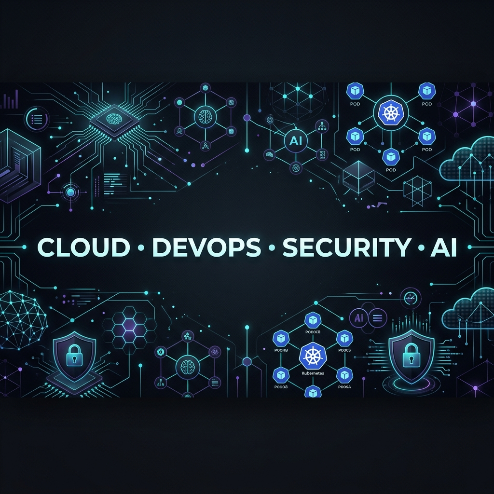

# 👋 Hi, I'm Supraj Maripeddi

  

## 🤖 AI Engineer building agentic systems on a production Cloud & DevOps foundation

I’m an engineer with **9+ years across Cloud, DevOps, DevSecOps and database/platform engineering**, now deeply focused on **AI Engineering and Agentic AI** — building practical systems that can reason, use tools, retrieve knowledge, automate workflows and safely operate across real infrastructure.

My current work sits at the intersection of **LLMs + Agents + MCP + RAG + Cloud Infrastructure + Kubernetes**. I’m especially interested in moving AI beyond chat interfaces into **production-grade agents that can observe, decide, call tools, collaborate with other agents and execute real engineering workflows**.

> **Current direction:** AI Agents · Multi-Agent Systems · MCP · RAG · LLM Applications · AI for DevOps/SRE · Amazon Bedrock & AgentCore · LangGraph · OpenAI Agents SDK · Production AI

---

## 🧠 What I'm focused on now

<table width="100%">
  <tr>
    <td width="50%" valign="top">
      <h3>🤖 Agentic AI Engineering</h3>
      <ul>
        <li>Designing tool-using AI agents with planning, memory, structured outputs and human-in-the-loop controls.</li>
        <li>Exploring single-agent and multi-agent orchestration patterns for real-world engineering workflows.</li>
        <li>Building with modern agent ecosystems including LangGraph, OpenAI Agents SDK, Google ADK and Amazon Bedrock/AgentCore.</li>
      </ul>
    </td>
    <td width="50%" valign="top">
      <h3>🔌 MCP & AI Tooling</h3>
      <ul>
        <li>Building and experimenting with Model Context Protocol servers that expose infrastructure and application capabilities to AI systems.</li>
        <li>Connecting agents to Kubernetes, cloud platforms, automation workflows, messaging systems and developer tooling.</li>
        <li>Focusing on safe permissions, auditability and production-ready tool execution.</li>
      </ul>
    </td>
  </tr>
  <tr>
    <td width="50%" valign="top">
      <h3>📚 RAG & LLM Applications</h3>
      <ul>
        <li>Working with embeddings, vector search, chunking, semantic/hybrid retrieval, reranking and grounded generation.</li>
        <li>Building AI applications that combine proprietary knowledge, tools and structured workflows.</li>
        <li>Exploring LlamaIndex, memory systems, evaluation, observability and guardrails.</li>
      </ul>
    </td>
    <td width="50%" valign="top">
      <h3>☁️ AI + Cloud / DevOps</h3>
      <ul>
        <li>Applying AI to Kubernetes operations, incident investigation, CI/CD, infrastructure automation and platform engineering.</li>
        <li>Bringing production engineering discipline to AI systems: containers, IaC, security, observability and reliability.</li>
        <li>Designing toward autonomous but controlled DevOps/SRE workflows.</li>
      </ul>
    </td>
  </tr>
</table>

---

## 🚀 Selected AI & Agent Projects

### [🛠️ devops-mcp-server](https://github.com/MaripeddiSupraj/devops-mcp-server)
AI-native **Model Context Protocol server for DevOps**, connecting LLM/agent workflows with infrastructure operations and engineering tools.

### [🧠 multi-agent-orchestrator](https://github.com/MaripeddiSupraj/multi-agent-orchestrator)
Exploration of **multi-agent orchestration**, coordination and agent-driven workflows for complex tasks.

### [⚙️ ai-engineering-hub](https://github.com/MaripeddiSupraj/ai-engineering-hub)
Hands-on AI engineering reference covering patterns, experiments and practical implementations across the modern LLM ecosystem.

### [☸️ kubectl-ai](https://github.com/MaripeddiSupraj/kubectl-ai)
Exploring how **AI and Kubernetes operations** can come together for more natural, assisted and automated cluster workflows.

### [💬 whatsapp-mcp](https://github.com/MaripeddiSupraj/whatsapp-mcp)
MCP-based experimentation around connecting AI agents with **WhatsApp and messaging workflows**.

### [📚 ai-cookbook](https://github.com/MaripeddiSupraj/ai-cookbook)
A growing collection of practical AI examples and implementation patterns.

### [🔌 awesome-mcp-servers](https://github.com/MaripeddiSupraj/awesome-mcp-servers) · [🧰 awesome-devops-mcp](https://github.com/MaripeddiSupraj/awesome-devops-mcp)
Curated MCP ecosystem references with a strong focus on **agent tools and DevOps automation**.

### [☁️ AWS-Bedrock](https://github.com/MaripeddiSupraj/AWS-Bedrock)
Experiments and learning around **Amazon Bedrock and cloud-native generative AI**.

---

## 🧩 AI Engineering Stack

**Areas:** LLMs · AI Agents · Multi-Agent Systems · MCP · RAG · Tool Calling · Structured Outputs · Embeddings · Vector Search · Reranking · Guardrails · Evaluation · LLMOps · AI Observability

---

## 🏗️ Production Engineering Foundation

My AI work is backed by years of hands-on infrastructure and platform engineering experience.

### ☁️ Cloud & Infrastructure

### ☸️ Containers, Kubernetes & Delivery

### 🔐 DevSecOps & Platform Security

---

## 🔭 What I'm building toward

I’m interested in the next generation of **AI-native engineering systems** where agents can securely work across software delivery and cloud infrastructure — investigating incidents, understanding systems, generating changes, validating them, collaborating with humans and executing controlled actions.

That means combining:

**AI reasoning + reliable tools + strong context + permissions + observability + cloud-native engineering.**

---

## 📊 GitHub Activity

  
  

---

## 🤝 Connect

  
  

> Building at the intersection of **Agentic AI, Cloud and DevOps** — with a strong bias toward practical, production-ready systems.
